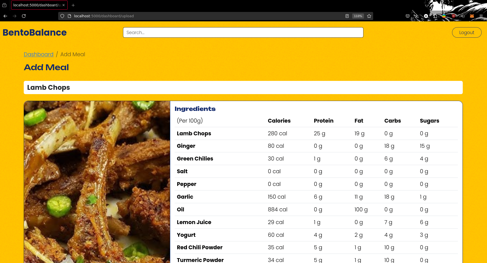
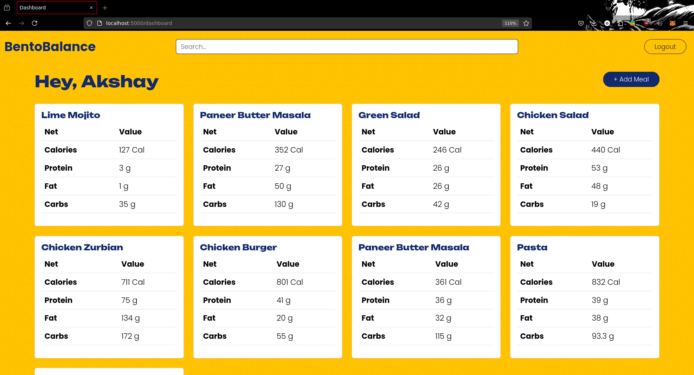

# 🍱 BentoBalance - Calorie Calculator Website

BentoBalance is a modern, AI-powered calorie calculator that helps users keep track of their meals and nutritional intake. With a sleek design, intuitive interface, and powerful image analysis capabilities, it makes managing a healthy diet easier than ever.

---

## 🚀 Features

- **OAuth2 Authentication**: Secure login and signup using Passport.js.
- **AI-Powered Meal Analysis**: Upload meal images and get detailed nutritional information on ingredients and total values.
- **Personal Dashboard**: Add, view, edit, and delete meals all in one place.
- **Real-time Nutritional Breakdown**: Get instant feedback on calories, protein, carbs, and more.
- **Simple and Intuitive Interface**: Designed with user-friendliness in mind for a seamless experience.

---

## 📸 Screenshots

<!-- Optionally, add screenshots of your app -->
| Home Page | Meal Analysis | Dashboard |
| --- | --- | --- |
|  |  |  |

---

## 🛠️ Tech Stack

- **Node.js**: Backend framework
- **Express.js**: Web application framework
- **MongoDB**: Database for storing user and meal data
- **Passport.js (OAuth2)**: Secure user authentication
- **Gemini API**: For analyzing meal images and generating nutritional facts

---

## 📂 Project Structure

```
|-- public/
|   |-- css/                # Stylesheets
|   |-- img/                # Image assets
|
|-- server/
|   |-- config/             # Configuration files (e.g., db.js)
|   |-- controllers/        # Controllers for dashboard and main functionality
|   |-- middleware/         # Custom middlewares (e.g., authentication)
|   |-- models/             # Database models (e.g., User.js, Meals.js)
|   |-- routes/             # App routes (auth, dashboard, etc.)
|
|-- views/                  # EJS template views
|-- uploads/                # Uploaded meal images
```

---

## ⚙️ Installation

1. Clone the repository:
    ```bash
    git clone https://github.com/akshay-rf/bentobalance.git
    ```

2. Install dependencies:
    ```bash
    npm install
    ```

3. Set up environment variables:
    ```bash
    touch .env
    ```

    Fill in the `.env` file with your environment variables:
    ```
    API_KEY=<googleai_studio_api_key>
    MONGODB_URI=<MongoDB_URL>
    GOOGLE_CLIENT_ID=<google_client_id>
    GOOGLE_CLIENT_SECRET=<google_client_secret>
    GOOGLE_CALLBACK_URL="http://localhost:5000/auth/google/callback"
    ```

4. Start the application:
    ```bash
    npm start
    ```

5. Open your browser and navigate to `http://localhost:5000`

---

## 🤖 How It Works

1. **Sign Up**: Sign up or log in via Google OAuth2 authentication.
2. **Upload a Meal**: Click "Add Meal" to upload an image of your meal.
3. **Image Analysis**: BentoBalance uses a machine learning model to analyze the meal and predict the nutritional facts.
4. **Manage Meals**: Once satisfied with the prediction, add the meal to your dashboard. You can edit or delete it anytime.

---

## 🎯 Roadmap

- [ ] Improve accuracy of meal analysis
- [ ] Add support for multiple languages
- [ ] Integrate with fitness trackers
- [ ] Add meal plan suggestions based on user goals

---

## 🤝 Contributing

Contributions are welcome! If you'd like to contribute, feel free to submit a pull request or open an issue.

1. Fork the repository.
2. Create your feature branch (`git checkout -b feature/YourFeature`).
3. Commit your changes (`git commit -m 'Add some feature'`).
4. Push to the branch (`git push origin feature/YourFeature`).
5. Open a pull request.

---

## 📝 License

This project is licensed under the MIT License. See the [LICENSE](LICENSE) file for details.

---

## 🌟 Acknowledgements

- **Gemini API**: For providing image analysis capabilities
- **Passport.js**: For making authentication easy
- **MongoDB**: For flexible and scalable data management

---

Made by [Akshay RF](https://github.com/akshay-rf)
