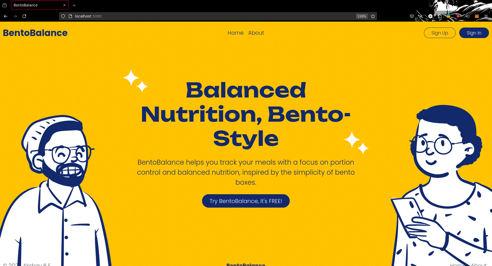
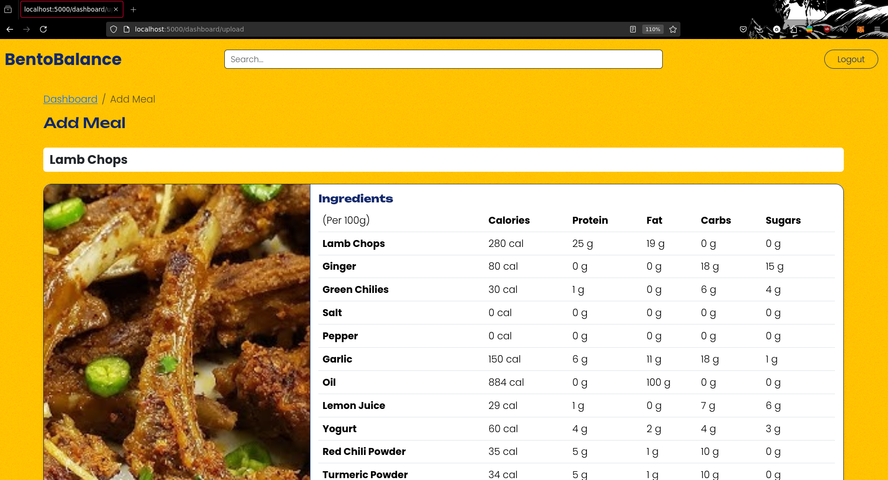
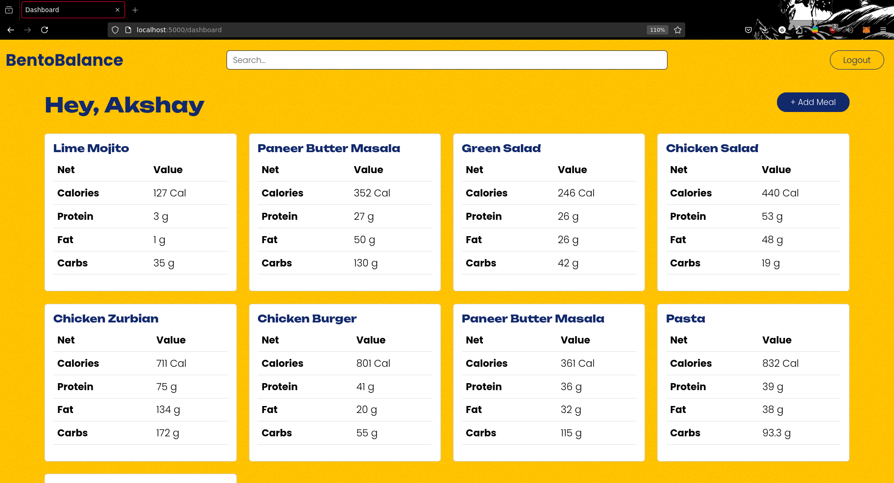

# BentoBalance

BentoBalance is an Express + EJS web app for meal tracking and AI-assisted fitness coaching.

It includes:
- Meal logging and dashboard management
- Gemini-powered meal analysis
- Real-time fitness coach (frame-by-frame analysis + speech guidance)
- Clerk-based authentication

## Features

- Clerk authentication for sign-in/session handling
- Meal CRUD flows from dashboard
- Gemini meal analysis from uploaded images
- Real-time form coach for squat, pushup, and plank
- Session-aware coaching loop (continuous frame capture)
- TTS audio feedback with browser speech fallback when Gemini TTS quota is unavailable

## Tech Stack

- Node.js
- Express.js
- EJS + express-ejs-layouts
- MongoDB + Mongoose
- Clerk (`@clerk/express`, `@clerk/backend`)
- Google Gemini (`@google/generative-ai`)

## Project Structure

```
app.js
public/
    css/
    img/
server/
    config/
    controllers/
    middleware/
    models/
    routes/
    services/
    utils/
views/
    auth/
    dashboard/
    layouts/
    partials/
uploads/
```

## Setup

1. Install dependencies:

```bash
npm install
```

2. Create `.env` and set values:

```env
NEXT_PUBLIC_CLERK_PUBLISHABLE_KEY=your_clerk_publishable_key
CLERK_SECRET_KEY=your_clerk_secret_key

GEMINI_API_KEY=your_gemini_api_key
GEMINI_MODEL=gemini-2.5-flash
GEMINI_TTS_MODEL=gemini-2.5-flash-preview-tts
GEMINI_TTS_VOICE=Kore

MONGODB_URL=mongodb://localhost:27017/fitsense
BASE_URL=http://localhost:3000
PORT=8000
```

3. Start the app:

```bash
npm start
```

4. Open:

```text
http://localhost:8000
```

## Fitness Coach Notes

- The coach sends webcam frames to `/dashboard/fitness-coach/analyze` on a timed loop.
- Backend returns `correction` and optional audio.
- If Gemini TTS fails (for example, quota 429), UI falls back to browser speech synthesis.
- Session handling includes token refresh/retry behavior for coach API calls.

## Screenshots

| Home Page | Meal Analysis | Dashboard |
| --- | --- | --- |
|  |  |  |

## License

MIT. See [LICENSE](LICENSE).

Made by [Akshay RF](https://github.com/akshay-rf)
